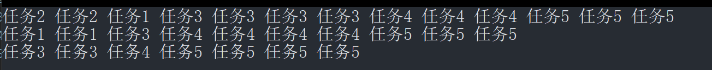
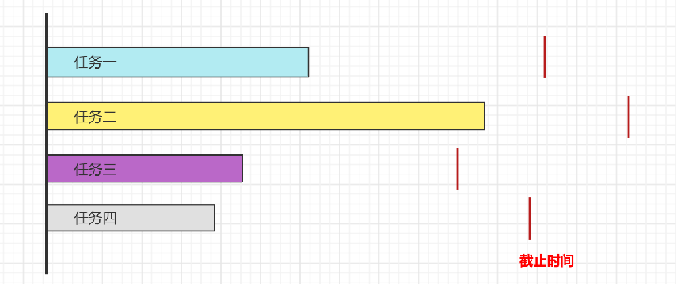
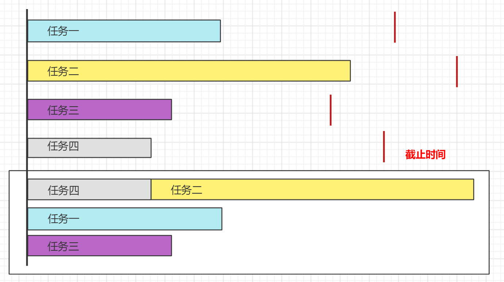
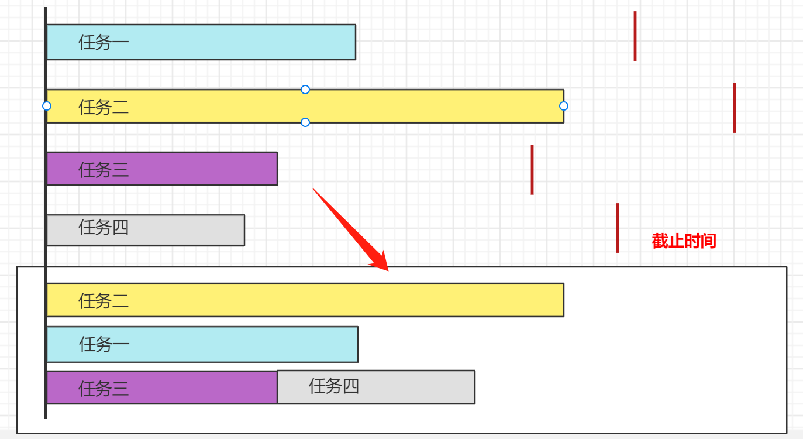
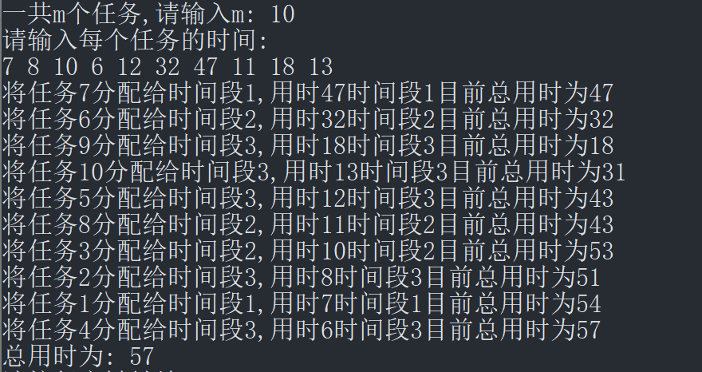
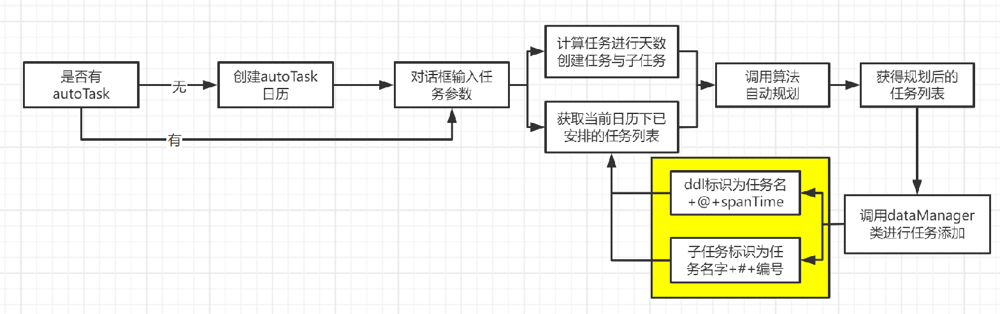
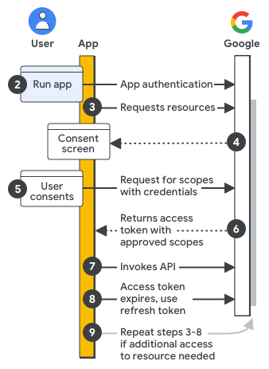
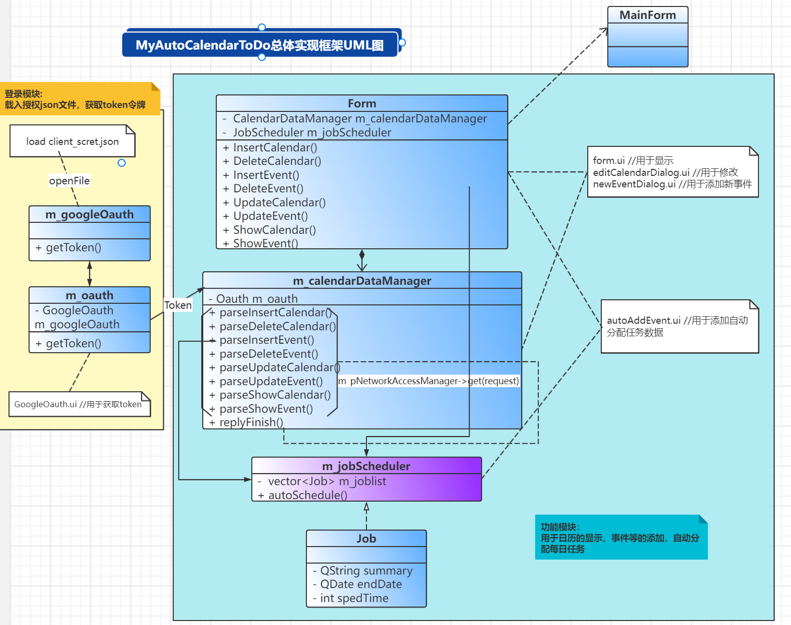

# 基于区间调度算法并结合Qt设计自动规划每日任务程序

## 算法设计缘起

设计这一算法最初源于生活，在生活中，我们常常要完成各种各样的学习工作任务，往往这些任务都有截止时间，当某一个时期，任务数量大时，计划任务安排所花费的时间可能还要比我们进行任务的管理花费的时间还要长，如果不进行任务的计划管理，很容易造成任务完成的失衡或者手忙脚乱的情况，在这种情况下，设计高效的可替代人力进行的自动化任务规划算法，指定各项任务的截止时间，然后进行算法设计将会节省大量时间，省去我们进行任务规划所花费的时间。

基于以上思考，进行本课题算法设计研究，并结合Qt和Google Calendar API 进行应用程序开发，以期能够将课堂上学习到的算法知识运用到日常生活中。

本项目利用Qt结合google Oauth2验证，借助google calendar api接口连接google calendar，在算法上结合算法导论中的区间调度算法及其拓展问题算法，实现了具有UI界面的自动化的个人日程管理软件MyAutoCalendarToDo，实现了算法导论课堂上学习到的区间调度算法运用于实际生活中。

## 实际问题抽象

首先，我们需要对功能细节化，针对我们的需求，对实际问题进行抽象：

设定每一件待办事项的截止时间，设定每一件待办事项的估计完成时间，然后自动进行每一天的任务划分。简单起见，我们先来实现紧凑模式，即每一天的空闲时间都被利用，没有空闲时间没有安排任务的情况。

为了实现方便，我们先来简单建立一个模型，后续对模型再进行修正，我们设定一下两个条件作为项目的基础条件：

1. 每天的空闲工作时间是9h，合理起见，分配每天的可进行的任务数量为3；

2. 指定任务的截止时间与任务的持续时间；

基于上面设定的条件，我们最后的目标实际上就是最小化延迟，在算法导论课程中，我们对单资源的最小化延迟调度问题做了探讨与证明，证明贪心算法，即优先完成截止时间最近的项目，最后的延迟最小，这里不详细探讨了。

而对于这个问题来说，实际上我们有多个资源，即每次可以加三个任务，如果将上述思路扩展到多资源的区间调度，那么只需要每次将前三个截止时间最近的项目加入到每天的任务列表当中，基于贪心的这种策略可行吗？

当然，我们已经将问题进行最简化了，实际上，我们还有其他可以探讨的问题：

1. 如果考虑周六日和工作周的任务量不一样怎么办？
2. 如果考虑到上课工作等无空闲的时间怎么办？
3. 如果考虑到不同事项的优先级不一样怎么办？

可以发现，这个问题本身就属于一个区间调度问题，对于区间调度问题，很多都是NP完全问题，甚至是NP难问题，很复杂的模型很难给出一个多项式时间解法，甚至找不到一个可靠的近似算法；事实上，就算我们设定的是上面简单的模型，也只能设计对应的近似算法，这里暂且不谈。

对于以上建立的简单模型，我们首先设计针对多资源的最小延迟调度贪心算法。

## 算法设计与分析

根据以上的分析，首先我们设计了基于多资源的最小化延迟调度的贪心策略：

```c++
void autoArrange() {
	//首先定义一个jobvector，然后进行排序
	//排序将任务依次添加进入三个列表中
	vector<Job>joblist;
	Job job1, job2, job3, job4, job5;
	job1.name = "任务1"; job1.time = 9; job1.number = 3;
	job2.name = "任务2"; job2.time = 6; job2.number = 2;
	job3.name = "任务3"; job3.time = 15; job3.number = 7;
	job4.name = "任务4"; job4.time = 15; job4.number = 8;
	job5.name = "任务5"; job5.time = 20; job5.number = 10;
	joblist.push_back(job1); joblist.push_back(job2); joblist.push_back(job3); joblist.push_back(job4); joblist.push_back(job5);
	vector<Job>result1, result2, result3;
	sort(begin(joblist), end(joblist),
		[](const Job& j1, const Job& j2) {return j1.time < j2.time; });
	while (joblist.size() > 0)
	{
		result1.push_back(joblist[0]); joblist[0].number--;
		if (joblist.size() > 1) { result2.push_back(joblist[1]); joblist[1].number--; }
		if (joblist.size() > 2) { result3.push_back(joblist[2]); joblist[2].number--; }

		if (joblist.size() > 2)
		{
			if (joblist[2].number == 0)joblist.erase(joblist.begin() + 2);
		}
		if (joblist.size() > 1)
		{
			if (joblist[1].number == 0)joblist.erase(joblist.begin() + 1);
		}
		if (joblist[0].number == 0)
			joblist.erase(joblist.begin());
	}
}
```

结果测试：



对于上述算法，可以看到首先进行了排序，然后再进行任务分配，算法复杂度为O(nlogn)，但是这种算法实际上并不是最优的算法，例如对于下面的情况：



多资源的最小化延迟调度的贪心算法的策略输出的结果如下：



但是实际上，我们可以有更好的结果，如下图所示：



在之前的多资源的最小化延迟调度中，可以发现如果优先安排截止时间最近的算法，会造成最后只剩下持续时间最长的任务，任务规划的算法不够合理，我们尝试优先安排持续时间较长的任务，具体的算法思路是：

首先将n个作业从大到小排序，然后依此顺序将作业分配给空闲的时间段。也就是说从剩下的作业中，选择需要处理时间最长的，然后依次选择处理时间次长的，直到所有的作业全部处理完毕，或者不能再处理其他作业为止。如果我们每次是将需要处理时间最短的作业分配给空闲的时间段，那么可能就会出现其它所有作业都处理完了只剩所需时间最长的作业在处理的情况，这样势必效率较低。

可以发现上面的算法的思路与之前的贪心算法的策略的目标有所区别，之前贪心算法的思路是最小化最后的延迟时间，但是，上面这种算法的思路的目标是最小化全部任务执行完毕的时间。根据以上的思路我们设计算法：

```c++
bool cmp(pair<int, int> A, pair<int, int> B)
{
    return A.second > B.second;  //降序排列
}
int JobSort(vector<pair<int, int>>& Job, int n)
{
    int m = Job.size();
    sort(Job.begin(), Job.end(), cmp);
    int timeTotal = 0;
    vector<int> timeOfMachine(n, 0);
    int pos = 0;  //表示Job数组的下标
    while (m--)
    {
        int minPosition = min_element(timeOfMachine.begin(), timeOfMachine.end()) - timeOfMachine.begin();
        timeOfMachine[minPosition] += Job[pos].second;
        cout << "将任务" << Job[pos].first << "分配给时间段" << minPosition + 1 << ",用时" << Job[pos].second;
        cout << "时间段" << minPosition + 1 << "目前总用时为" << timeOfMachine[minPosition] << endl;
        pos++;
    }
    return *max_element(timeOfMachine.begin(), timeOfMachine.end());
}
```

在这种算法中，我们同样进行了排序，只不过这次排序的依据是任务的持续时间，然后遍历，最后的算法复杂度为O(nlogn)。

结果测试



但是，这种基于策略依旧不是最优的策略，事实上，这个问题是一个NP完全问题，找不到一个多项式的解法，我们可以证明：这种算法是这个问题的一个4/3近似求解算法，很接近最后的最优解了。

针对这一算法，笔者尝试了其他算法例如分枝定界策略，或者回溯策略，算法代码如下所示：

```c++
//分支定界策略算法
struct node                                         //定义一个node
{
    int time[M];                                    //当前的time
    int num;                                        //当前的位置
    int tt;                                         //当前的最大值
    bool operator<(const node& a)const {				//重载运算符，实现优先队列从小到大排列
        return tt > a.tt;
    }
}point;                                             //当前点

int p_queue() {
    priority_queue<node> q;

    for (int i = 1; i <= k; i++) {                   //初始化
        point.time[i] = 0;
    }
    point.num = 0;
    point.tt = 0;

    while (point.tt < best) {                        //不符合退出循环
        if (point.num == n) {
            best = point.tt;                        //达到最后一点给best赋值
        }
        else {
            for (int i = 1; i <= k; i++) {
                node next;                          //定义中间变量并赋值
                next.num = point.num + 1;
                for (int m = 1; m <= k; m++) {
                    next.time[m] = point.time[m];
                }
                next.time[i] += x[next.num];
                next.tt = max(next.time[i], point.tt);

                if (next.tt < best) {                //剪枝
                    q.push(next);
                }
            }
        }

        if (q.empty()) {                              //队列无值退出循环
            return best;
        }
        else {                                      //取队列中第一个值进入下一步循环
            point = q.top();
            q.pop();
        }
    }
    return best;
}
```

```c++
//回溯策略算法
int comp() {
	int tmp = 0;
	for (int i = 0; i < k; i++)
		if (len[i] > tmp)
			tmp = len[i];
	return tmp;
}
void search(int dep, int* len, int* t) {
	if (dep == n) {
		int tmp = comp();
		if (tmp < best)
			best = tmp;
		return;
	}
	for (int i = 0; i < k; i++) {
		len[i] += t[dep];
		if (len[i] < best)
			search(dep + 1, len, t);
		len[i] -= t[dep];
	}
}
```

虽然他们相比于贪心策略，解的质量有所改善，但是相应的算法复杂度却大大提高，例如分支定界策略在无任何剪枝操作情况下，算法的复杂度甚至达到了O(N!)级别，这是不可接受的，因此笔者在权衡一番后还是使用贪心策略作为程序设计的主要算法。

另外，对于更加复杂的模型，受时间所限，以及调度问题本身作为NP或者NP难问题的难度所限，笔者在经过种种尝试之后，仍然没有涉及出对于更加复杂模型的适用解法，这也是本项目的遗憾之处，本程序设计的亮点在于将算法融合进实际的生活中，实现了运用所学知识进行算法设计。

## 结果测试

本程序设计采用的是上面讨论的第二种算法策略，在Qt中调用算法实现的逻辑如下图所示：



由于实现程序的特殊性，具体的程序测试结果已经在视频当中展示了，这里不做展示了。

## 参考

Algorithms and theory of computation handbook, volume 2: special topics and techniques[M]. CRC press, 2009.

Kleinberg J, Tardos E. Algorithm design[M]. Pearson Education India, 2006.

## 附录

全部代码已经上传github：

附录是笔者在完成整个项目开发过程中关于Qt程序设计的一些记录：

### 利用google calendar api连接到google calendar

#### 如何使用google calendar api？

查阅Google API开发手册得知，要使用google celendar api必须首先开启calendar api服务，然后根据开启服务的访问凭据动态获取登录的token令牌，借助token令牌来使用api服务。细化来讲，分为以下几个部分：

1. 配置Google Cloud 项目和应用程序：在开发期间，需要在 Google Cloud Console 中注册应用程序，定义授权范围和访问凭据，以使用 API 密钥、最终用户凭据或服务帐户凭据对应用程序进行身份验证。
2. 验证应用程序的访问权限：当应用程序运行时，将评估注册的访问凭据。如果应用程序正在以最终用户身份进行身份验证，则可能会显示登录提示。
3. 请求资源：当应用需要访问 Google 资源时，它会使用之前注册的相关访问范围向 Google 询问。
4. 征求用户同意：如果应用以最终用户身份进行身份验证，Google 会显示 OAuth 同意屏幕，以便用户决定是否授予应用访问所请求数据的权限。
5. 发送已批准的资源请求：如果用户同意访问范围，应用会将凭据和用户批准的访问范围捆绑到请求中。该请求被发送到 Google 授权服务器以获取访问令牌。
6. Google 返回访问令牌：访问令牌包含授予的访问范围列表。如果返回的范围列表比请求的访问范围更受限制，应用程序将禁用任何受令牌限制的功能。
7. 访问请求的资源：应用程序使用来自 Google 的访问令牌来调用相关 API 并访问资源。



Google API的访问步骤

笔者已开通google calendar api的访问权限，关键是如何代码实现令牌的获取，实际上，我们有一个类是专门处理token令牌获取的，这个类就QOAuth2AuthorizationCodeFlow类，只需要将client_scret参数load到类中，我们就可以根据类内的一些方法来实现，下面是GoogleQauth类中的一些方法以及其功能：

| 方法                           | 功能                   |
| ------------------------------ | ---------------------- |
| initialOAuth()                 | 初始化                 |
| onGoogleGranted()              | 谷歌授权参数传递       |
| onGoogleAuthorizeWithBrowser() | 浏览器打开谷歌授权界面 |
| accessToken()                  | 获取令牌               |

#### 使用google calendar api的一系列方法

下面结合本项目查看：

```c++
//获取calendar
void CalendarDataManager::getCalendars(const QString& access_token)
{
    qDebug() << Q_FUNC_INFO;
    QString s = QString("https://www.googleapis.com/calendar/v3/users/me/calendarList?access_token=%1").arg(access_token);//传入参数
    QApplication::setOverrideCursor(Qt::WaitCursor);
    m_pNetworkAccessManager->get(QNetworkRequest(QUrl(s)));//发送给网络端
}
```

```c++
void CalendarDataManager::newCalendar(const QString& access_token, const QString & name)
{
    QString s = QString("https://www.googleapis.com/calendar/v3/calendars?access_token=%1").arg(access_token);

    QByteArray params;
    params.append(QString("{ \"summary\": \"%1\" }").arg(name).toUtf8());
    QNetworkRequest request;
    request.setUrl(QUrl(s));
    request.setRawHeader("Content-Type", "application/json");

    QApplication::setOverrideCursor(Qt::WaitCursor);
    m_pNetworkAccessManager->post(request, params);
}
```

还有一些其他的例子也是同样的道理，参考官方文档就可以学习到。另外还有一个很重要的方法就是要将上述发送给网络端中的数据提取出来：

```c++
void CalendarDataManager::replyFinished(QNetworkReply * reply)
{
    QApplication::restoreOverrideCursor();
    qDebug() << __FUNCTION__;
    QString json = reply->readAll();
    qDebug() << "Reply = " << json;
    qDebug() << "URL = " << reply->url();
    QString strUrl = reply->url().toString();
    ……
}//这里的url就是后面有一大堆key-value值的json形式的内容，只要知道key值就可以提取出具体的值。
```

这样，我们就完成了通过api和google calendar进行连接了，设计Qt界面部分省略。

### 整个程序设计UML图


